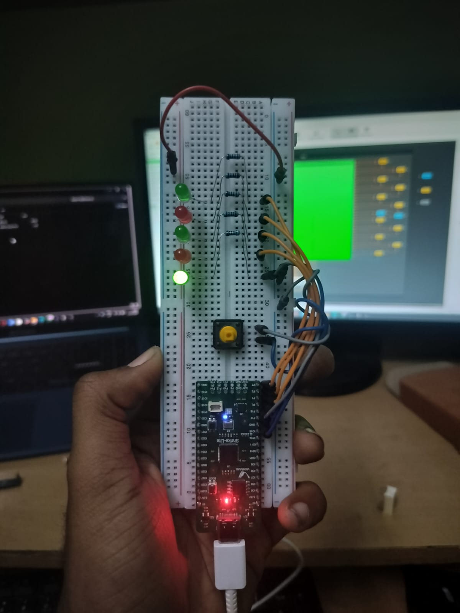
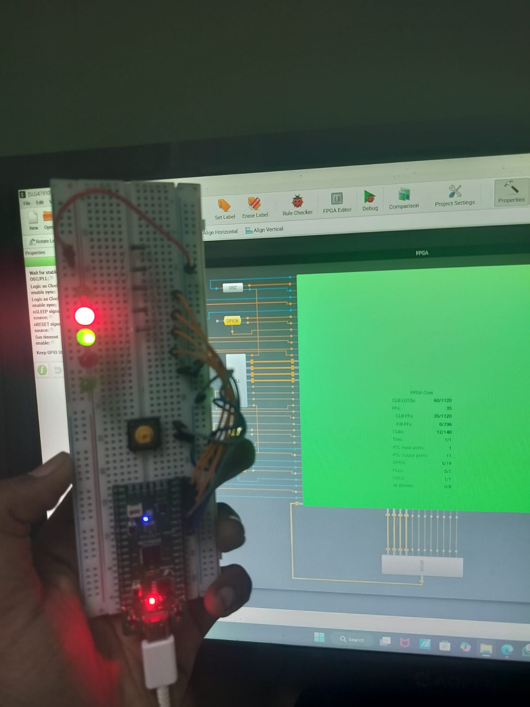

# Blink - Sequential LED Pattern

A sequential LED blinking project that cycles through 5 LEDs in order, demonstrating basic sequential logic and one-hot encoding on the Vicharak Shrike FPGA board.

## Project Overview

This project creates a visually appealing LED pattern where each of the 5 onboard LEDs lights up one at a time in sequence. The design uses a counter to control the timing and one-hot encoding for efficient LED control.

## Hardware Setup




## Output Demonstration

<video width="640" controls>
  <source src="blink_vid.mp4" type="video/mp4">
  Your browser does not support the video tag.
</video>

### Video Explanation

The video demonstrates the sequential LED blinking pattern in action:

1. **LED Sequence**: The 5 LEDs (LED0 through LED4) light up one at a time in order
2. **Timing**: Each LED stays lit for approximately 0.1 seconds (5,000,000 clock cycles at 50MHz)
3. **Looping**: After LED4, the pattern wraps around back to LED0 and continues indefinitely
4. **One-Hot Encoding**: Only one LED is active at any given time, creating a clean sequential effect

The smooth transition between LEDs shows the precise timing control achieved through the hardware counter, demonstrating how FPGAs can create accurate, deterministic timing patterns.

## Verilog Code

```verilog
(* top *) 
module blink (
  (* iopad_external_pin, clkbuf_inhibit *) input  clk,
  (* iopad_external_pin *) output [4:0] LED,
  (* iopad_external_pin *) output [4:0] LED_en,
  (* iopad_external_pin *) output clk_en
);

  reg [31:0] counter = 32'd0;
  reg [2:0]  led_ptr = 3'd0;
  reg [4:0]  LED_reg;

  localparam integer BLINK_CNT = 32'd5_000_000; 

  assign LED_en = 5'b11111;
  assign clk_en = 1'b1;
  assign LED    = LED_reg;

  always @(posedge clk) begin
    if (counter == BLINK_CNT) begin
      counter <= 32'd0;

      if (led_ptr == 3'd4)
        led_ptr <= 3'd0;
      else
        led_ptr <= led_ptr + 1'b1;

    end else begin
      counter <= counter + 1'b1;
    end
  end

  // FIFO one-hot LEDs
  always @(*) begin
    LED_reg = 5'b00000;
    LED_reg[led_ptr] = 1'b1;
  end

endmodule
```

## How It Works

### Key Components

1. **Clock Input (`clk`)**
   - Main timing source (typically 50MHz on Shrike board)
   - All sequential logic synchronizes to this clock

2. **Counter (`counter`)**
   - 32-bit register that counts from 0 to 5,000,000
   - Creates a time delay of 0.1 seconds per LED
   - Resets to 0 when reaching the maximum count

3. **LED Pointer (`led_ptr`)**
   - 3-bit register (0 to 4) that tracks which LED should be active
   - Increments on each counter overflow
   - Wraps from 4 back to 0 for continuous looping

4. **LED Register (`LED_reg`)**
   - 5-bit output controlling each LED
   - Uses one-hot encoding: only one bit is '1' at a time
   - The active bit position is determined by `led_ptr`

### Operation Flow

```
Clock Tick → Counter++ → Counter reaches 5M? 
                              ↓ Yes
                         Reset Counter
                         LED Pointer++
                              ↓
                    Update LED_reg using one-hot encoding
                              ↓
                    Display active LED on hardware
```

### One-Hot Encoding

The one-hot encoding technique is implemented in the combinational always block:

```verilog
LED_reg = 5'b00000;        // Start with all LEDs off
LED_reg[led_ptr] = 1'b1;   // Turn on only the selected LED
```

**Examples**:
- `led_ptr = 0` → `LED_reg = 5'b00001` (LED0 on)
- `led_ptr = 1` → `LED_reg = 5'b00010` (LED1 on)
- `led_ptr = 2` → `LED_reg = 5'b00100` (LED2 on)
- `led_ptr = 3` → `LED_reg = 5'b01000` (LED3 on)
- `led_ptr = 4` → `LED_reg = 5'b10000` (LED4 on)

### Timing Calculation

With a 50MHz clock:
- Clock period = 20ns
- Blink interval = 5,000,000 cycles × 20ns = 100ms = 0.1 seconds
- Full sequence (5 LEDs) = 0.5 seconds

## Key Concepts Demonstrated

- **Sequential Logic**: Using registers and clocks to create time-based behavior
- **State Machines**: The `led_ptr` acts as a simple state variable
- **One-Hot Encoding**: Efficient method for controlling mutually exclusive outputs
- **Counter Design**: Building precise timing intervals
- **Module Attributes**: Using FPGA-specific attributes for pin mapping

## Learning Outcomes

After studying this project, you will understand:
- How to create timing delays using counters
- Sequential logic design with always blocks
- One-hot encoding for LED control
- Wrapping counter logic (0→4→0)
- Basic FPGA pin constraints and attributes

## Customization Ideas

- **Change Speed**: Modify `BLINK_CNT` to make LEDs blink faster or slower
- **Reverse Direction**: Decrement `led_ptr` instead of incrementing
- **Binary Counter**: Change LED pattern to display binary numbers
- **Knight Rider Effect**: Make the LED bounce back and forth

## Hardware Connections

| Signal | Description |
|--------|-------------|
| `clk` | 50MHz system clock input |
| `LED[4:0]` | 5-bit output to onboard LEDs |
| `LED_en[4:0]` | Enable signals for LEDs (all enabled) |
| `clk_en` | Clock enable output |

All signals use the `iopad_external_pin` attribute for proper FPGA pin mapping.
