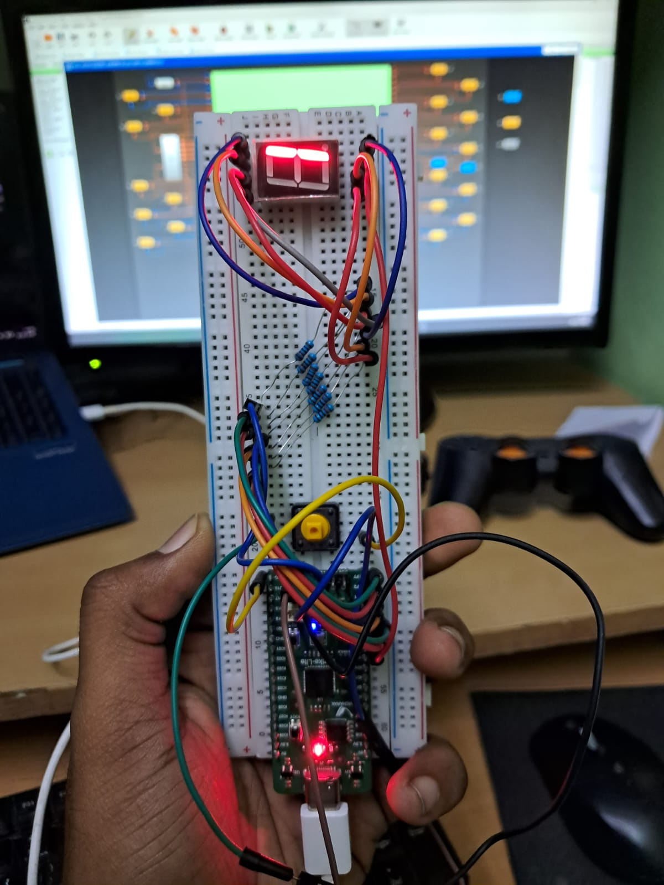
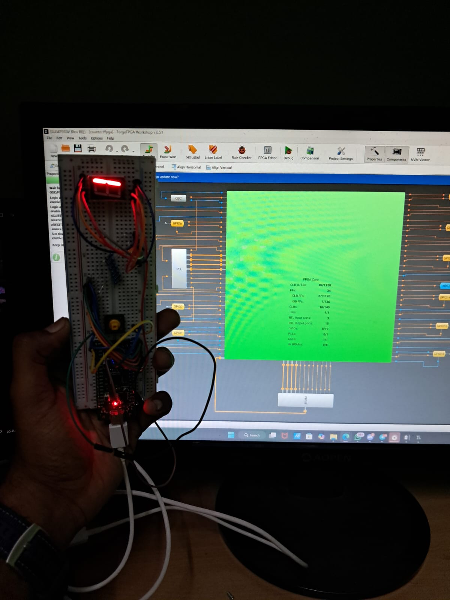

# Counter - Seven-Segment Display Counter

A 0-9 decimal counter with seven-segment display output, featuring button input with debouncing. This project demonstrates state machines, edge detection, and display encoding on the Vicharak Shrike FPGA board.

## Project Overview

This project implements a push-button controlled counter that displays digits 0-9 on a seven-segment display. Each button press increments the counter, showcasing practical button debouncing and segment encoding techniques.

## Hardware Setup





## Output Demonstration


### Video Explanation

The video demonstrates the seven-segment counter in action:

1. **Initial State**: Display shows '0' on the seven-segment display
2. **Button Press**: User presses the increment button
3. **Debouncing**: Hardware filters out button bounce/noise (invisible to user but crucial)
4. **Edge Detection**: System detects the rising edge of the button press
5. **Counter Increment**: Count value increases by 1 (0→1→2→...→9)
6. **Segment Update**: Seven-segment display updates to show the new digit
7. **Wrap Around**: After reaching '9', the next press returns to '0'

The smooth, glitch-free counting demonstrates effective button debouncing. Without debouncing, a single physical button press could register as multiple presses due to mechanical contact bounce, but this implementation filters that out using a 20ms debounce timer.

The seven-segment display lights up the appropriate segments (A-G) to form each digit clearly, showing proper segment encoding.

## Verilog Code

```verilog
(* top *) module seven_segment_counter (
    (* iopad_external_pin, clkbuf_inhibit *) input clk, // Clock input
    (* iopad_external_pin *) input reset,       
    (* iopad_external_pin *) output clk_en,   // clock enable
    (* iopad_external_pin *) input btn,        // Push button input
    (* iopad_external_pin *) output reg seg_0, // Segment A
    (* iopad_external_pin *) output reg seg_1, // Segment B
    (* iopad_external_pin *) output reg seg_2, // Segment C
    (* iopad_external_pin *) output reg seg_3, // Segment D
    (* iopad_external_pin *) output reg seg_4, // Segment E
    (* iopad_external_pin *) output reg seg_5, // Segment F
    (* iopad_external_pin *) output reg seg_6, // Segment G
    (* iopad_external_pin *) output seg_0_en,  // Enable for seg_0
    (* iopad_external_pin *) output seg_1_en,  // Enable for seg_1
    (* iopad_external_pin *) output seg_2_en,  // Enable for seg_2
    (* iopad_external_pin *) output seg_3_en,  // Enable for seg_3
    (* iopad_external_pin *) output seg_4_en,  // Enable for seg_4
    (* iopad_external_pin *) output seg_5_en,  // Enable for seg_5
    (* iopad_external_pin *) output seg_6_en   // Enable for seg_6
);

    // Internal signals
    reg [3:0] count;          // Counter (0-9)
    reg btn_prev;             // Previous button state
    reg btn_stable;           // Debounced button state
    reg [19:0] debounce_cnt;  // Debounce counter
    reg [6:0] seg;            // Internal segment register
    
    // Button debouncing (assuming 50MHz clock, ~20ms debounce)
    parameter DEBOUNCE_TIME = 20'd1000000;
    
    // Enable signals - always active for all segments
    assign seg_0_en = 1'b1;
    assign seg_1_en = 1'b1;
    assign seg_2_en = 1'b1;
    assign seg_3_en = 1'b1;
    assign seg_4_en = 1'b1;
    assign seg_5_en = 1'b1;
    assign seg_6_en = 1'b1;
    assign clk_en   = 1'b1 ;
    
    // Assign individual segments from internal register
    always @(*) begin
        seg_0 = seg[0];  // Segment A
        seg_1 = seg[1];  // Segment B
        seg_2 = seg[2];  // Segment C
        seg_3 = seg[3];  // Segment D
        seg_4 = seg[4];  // Segment E
        seg_5 = seg[5];  // Segment F
        seg_6 = seg[6];  // Segment G
    end
    
    // Button debouncing
    always @(posedge clk or posedge reset) begin
        if (reset) begin
            btn_prev <= 1'b0;
            btn_stable <= 1'b0;
            debounce_cnt <= 20'd0;
        end else begin
            if (btn != btn_prev) begin
                btn_prev <= btn;
                debounce_cnt <= 20'd0;
            end else if (debounce_cnt < DEBOUNCE_TIME) begin
                debounce_cnt <= debounce_cnt + 1;
            end else begin
                btn_stable <= btn_prev;
            end
        end
    end
    
    // Edge detection for button press
    reg btn_stable_prev;
    wire btn_press;
    
    assign btn_press = btn_stable && !btn_stable_prev;
    
    always @(posedge clk or posedge reset) begin
        if (reset) begin
            btn_stable_prev <= 1'b0;
        end else begin
            btn_stable_prev <= btn_stable;
        end
    end
    
    // Counter logic (0-9)
    always @(posedge clk or posedge reset) begin
        if (reset) begin
            count <= 4'd0;
        end else if (btn_press) begin
            if (count == 4'd9)
                count <= 4'd0;  // Wrap around to 0
            else
                count <= count + 1;
        end
    end
    
    // 7-segment decoder (common cathode)
    // Segment order: {g, f, e, d, c, b, a}
    // 1 = LED ON, 0 = LED OFF for common cathode
    always @(posedge clk or posedge reset) begin
        if (reset) begin
            seg <= 7'b0111111;  // Display 0
        end else begin
            case (count)
                4'd0: seg <= 7'b0111111;  // 0
                4'd1: seg <= 7'b0000110;  // 1
                4'd2: seg <= 7'b1011011;  // 2
                4'd3: seg <= 7'b1001111;  // 3
                4'd4: seg <= 7'b1100110;  // 4
                4'd5: seg <= 7'b1101101;  // 5
                4'd6: seg <= 7'b1111101;  // 6
                4'd7: seg <= 7'b0000111;  // 7
                4'd8: seg <= 7'b1111111;  // 8
                4'd9: seg <= 7'b1101111;  // 9
                default: seg <= 7'b0000000;  // Blank
            endcase
        end
    end

endmodule
```

## How It Works

### Seven-Segment Display Layout

```
     A (seg_0)
    ―――――
F  |       | B
   |   G   | (seg_1/2)
    ―――――
E  |       | C
   |       | (seg_3/4)
    ―――――
     D (seg_5)
```

Segment mapping: `{G, F, E, D, C, B, A}` = `{seg_6, seg_5, seg_4, seg_3, seg_2, seg_1, seg_0}`

### Key Components

#### 1. Button Debouncing Circuit

Mechanical buttons create electrical noise (bouncing) when pressed. The debouncer filters this:

```
Raw Button Press:    ↓ ↑↓ ↑↓↑ ↓↑ ↓ (noisy)
                     ↓_____________ (debounced)

Debounced Output:    Clean rising edge
```

**How it works**:
- Monitors button state changes
- Waits for 1,000,000 clock cycles (20ms at 50MHz) of stable state
- Only updates `btn_stable` after stability is confirmed

#### 2. Edge Detection

Detects the exact moment when the button transitions from unpressed to pressed:

```verilog
btn_press = btn_stable && !btn_stable_prev;
```

This creates a single-cycle pulse on the rising edge, preventing multiple counts from a single button press.

```
btn_stable:      ____↑‾‾‾‾‾‾‾‾‾↓____
btn_stable_prev: ______↑‾‾‾‾‾‾‾‾‾↓__
btn_press:       _____↑↓__________
                      ^ Single pulse
```

#### 3. Counter State Machine

Simple 0-9 counter with wrap-around:

```
State: 0 → 1 → 2 → 3 → 4 → 5 → 6 → 7 → 8 → 9 → 0 (loop)
       ↑                                           ↓
       └───────────────────────────────────────────┘
```

#### 4. Seven-Segment Decoder

Converts 4-bit binary count to 7-segment encoding:

| Digit | Binary | Segments {G,F,E,D,C,B,A} | Visual |
|-------|--------|-------------------------|--------|
| 0 | 0000 | 0111111 | All except G |
| 1 | 0001 | 0000110 | B, C only |
| 2 | 0010 | 1011011 | A,B,D,E,G |
| 3 | 0011 | 1001111 | A,B,C,D,G |
| 4 | 0100 | 1100110 | B,C,F,G |
| 5 | 0101 | 1101101 | A,C,D,F,G |
| 6 | 0110 | 1111101 | A,C,D,E,F,G |
| 7 | 0111 | 0000111 | A,B,C only |
| 8 | 1000 | 1111111 | All segments |
| 9 | 1001 | 1101111 | All except E |

### Operation Flow

```
Button Press → Debouncing (20ms) → Edge Detection → Counter++ 
                                                        ↓
Reset (if count=9)  ←─────────────────────────────────┘
                                                        ↓
        Display Update ←──── Seven-Segment Decode ←────┘
```

## Key Concepts Demonstrated

### 1. **Button Debouncing**
- Essential for reliable physical input handling
- Uses parameterized timing (20ms standard)
- State-based filtering approach

### 2. **Edge Detection**
- Converts level signals to pulse signals
- Prevents multiple triggers from single input
- Critical for counting applications

### 3. **State Machines**
- Counter represents a 10-state FSM
- State transitions on button press events
- Automatic wrap-around behavior

### 4. **Combinational Lookup (Case Statement)**
- Efficient mapping of count → segments
- ROM-like behavior synthesized in hardware
- Common cathode display encoding

### 5. **Synchronous Design**
- All state updates on clock edges
- Separate combinational and sequential logic
- Reset capability for initialization

## Learning Outcomes

After studying this project, you will understand:
- Real-world button interfacing challenges
- Time-based debouncing techniques
- Rising edge detection circuits
- Seven-segment display control
- BCD to segment encoding
- Modular counter design (0-N with wrap)
- Synchronous vs. combinational logic separation

## Timing Analysis

With a 50MHz clock (20ns period):
- **Debounce Time**: 1,000,000 cycles = 20ms
- **Edge Detection**: 1 cycle = 20ns response
- **Counter Update**: 1 cycle = 20ns
- **Display Update**: 1 cycle = 20ns

Total latency from stable button press to display update: ~20ms (debounce time dominates)

## Customization Ideas

1. **Count Up/Down**: Add direction control
   ```verilog
   input dir;  // 0=down, 1=up
   count <= dir ? (count + 1) : (count - 1);
   ```

2. **Hexadecimal Counter**: Extend to 0-F (add A-F patterns)

3. **Multi-Digit Display**: Add digit multiplexing for larger numbers

4. **Auto-Increment**: Add automatic counting mode with speed control

5. **Adjustable Debounce**: Make `DEBOUNCE_TIME` variable for different buttons

## Hardware Connections

| Signal | Type | Description |
|--------|------|-------------|
| `clk` | Input | 50MHz system clock |
| `reset` | Input | Asynchronous reset (active high) |
| `btn` | Input | Push button for increment |
| `seg_0` to `seg_6` | Output | Seven-segment outputs (A-G) |
| `seg_X_en` | Output | Enable signals (all high) |

## Common Issues & Solutions

**Issue**: Counter increments multiple times per press
- **Cause**: Insufficient debounce time or missing edge detection
- **Solution**: Increase `DEBOUNCE_TIME` or verify edge detector logic

**Issue**: Display shows wrong digits
- **Cause**: Incorrect segment encoding
- **Solution**: Verify common cathode vs. anode configuration, check segment mapping

**Issue**: No response to button
- **Cause**: Button not connected or inverted logic
- **Solution**: Check hardware connections, verify button active level

## Related Concepts

- **Finite State Machines (FSM)**: Counter is a simple FSM
- **Synchronizer Circuits**: Related to metastability prevention
- **Display Multiplexing**: For multi-digit displays
- **BCD Arithmetic**: Binary-Coded Decimal operations
